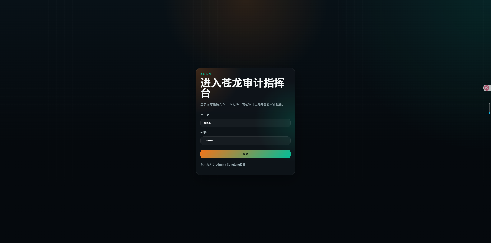
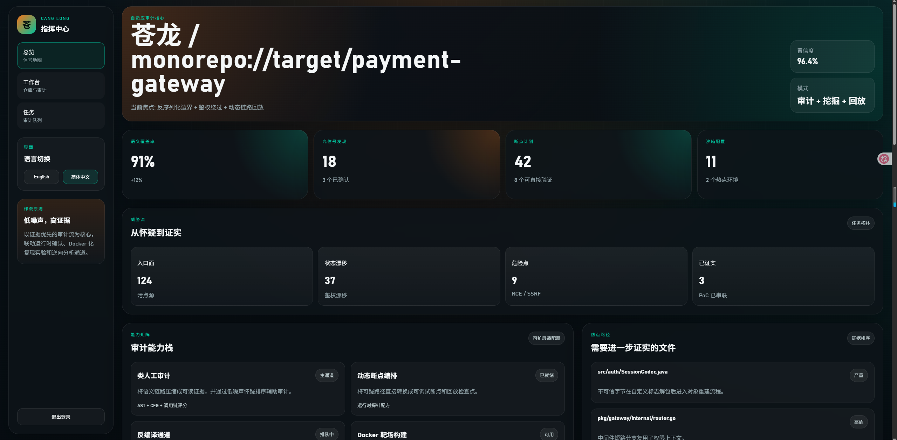
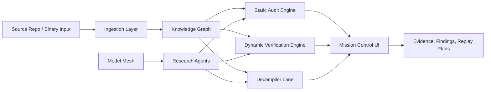

# Canglong

<div align="right">

[English](./README.md) | [简体中文](./README.zh-CN.md)

</div>

<div align="center">

**Evidence-first code audit, vulnerability research, dockerized verification, and model-assisted security operations**

<p>
  
  
  
  
  
</p>

<p>
  
  
  
  
  
  
</p>

</div>

> Canglong is designed to act less like a noisy scanner and more like a senior security reviewer:
> trace evidence, reduce false positives, generate proof paths, orchestrate docker ranges, and use the right model or agent for the right security task.




## Table Of Contents

- [Why Canglong](#why-canglong)
- [Core Capabilities](#core-capabilities)
- [System Architecture](#system-architecture)
- [Model Mesh](#model-mesh)
- [Repository Layout](#repository-layout)
- [Quick Start](#quick-start)
- [Current Snapshot](#current-snapshot)
- [API Surface](#api-surface)
- [Development Workflow](#development-workflow)
- [Roadmap](#roadmap)
- [Notes](#notes)

## Why Canglong

Most security tooling is strong at one of these and weak at the rest:

- static scanning without proof
- dynamic verification without graph context
- reverse engineering without a unified evidence model
- AI assistance without routing discipline or privacy boundaries

Canglong is structured to combine them into one operator-facing platform:

- human-like audit flow instead of raw rule dumps
- evidence-backed vulnerability promotion instead of severity inflation
- replayable docker environments for verification
- reverse-engineering lanes for APK, JAR, ELF, PE, and related binaries
- multi-model routing for exploit reasoning, long-context review, multimodal artifact digestion, and private deployments

## Core Capabilities

| Capability | What It Does | Why It Matters |
| --- | --- | --- |
| Human-like audit workflow | Converts code structure into evidence-ranked review paths | Reduces analyst fatigue and lowers false positives |
| Vulnerability research missions | Tracks one objective from suspicion to proof | Keeps exploitability and evidence connected |
| Dynamic breakpoint orchestration | Generates replay and debugging plans from static traces | Makes suspicious paths verifiable |
| Docker range builder | Creates isolated compose-based targets and fixtures | Speeds up reproduction and environment bootstrapping |
| Decompiler lane | Ingests reverse-engineered artifacts into the same graph | Unifies source and binary analysis |
| Multi-model mesh | Routes tasks across commercial and self-hosted LLMs | Matches cost, context, reasoning depth, and privacy needs |
| Research agents | Runs focused AI workers for exploit expansion and triage | Turns models into operator tools, not decoration |

## System Architecture



### Architecture Layers

| Layer | Current Direction |
| --- | --- |
| Ingestion | Repositories, archives, mounted workspaces, and binary inputs |
| Knowledge graph | File graph, symbol graph, taint graph, request-to-sink path graph |
| Static audit | Framework-aware sources, sinks, and semantic trace compression |
| Dynamic verification | Breakpoint recipes, replay capture, runtime contradiction handling |
| Reverse engineering | Decompiled symbols, endpoint recovery, string and secret mining |
| Model mesh | Provider routing based on task type, privacy, context, and cost |
| Mission control | Operator-facing UI for evidence, next actions, and proof paths |

<details>
<summary><strong>Design Principle: Lower False Positives</strong></summary>

Canglong should not promote every reachable sink as a severe finding. The intended strategy is:

- require multi-signal agreement before severity promotion
- keep raw evidence attached to every claim
- rank paths by exploitability, preconditions, and runtime reachability
- demote paths invalidated by guards, sanitizers, framework constraints, or container replay

</details>

## Model Mesh

The model layer is intentionally heterogeneous. Different security subtasks need different strengths.

| Provider Lane | Best Fit | Example Security Tasks |
| --- | --- | --- |
| OpenAI | deep reasoning, tool use, structured outputs | exploit-chain reasoning, agent orchestration, synthesis |
| Anthropic | long-context review | large codebase review, contradiction analysis, guard validation |
| Gemini | multimodal and large artifact digestion | decompiler artifacts, screenshots, diagrams, binary summaries |
| Qwen | self-hosted bilingual execution | private deployments, on-prem audit assistance |
| DeepSeek | cost-efficient broad reasoning | hypothesis sweeps, wide triage passes |
| Self-hosted mesh | isolation and policy control | air-gapped review, sensitive code paths, internal inference |

### Planned Research Agents

| Agent | Role | Expected Output |
| --- | --- | --- |
| Exploit Chain Researcher | expands suspicious paths into attack conditions and pivots | exploit hypotheses, replay prompts, proof checklists |
| False-Positive Reducer | cross-checks guards and contradictions before promotion | demotion suggestions, evidence gaps, contradiction logs |
| Docker Range Planner | turns hypotheses into runnable environments | compose plans, fixtures, probe recipes |
| Decompiler Recon Agent | turns reverse-engineered artifacts into attack-surface maps | recovered endpoints, symbol hints, library notes |

## Repository Layout

```text
.
|-- apps
|   |-- api
|   |   |-- app
|   |   |   |-- models
|   |   |   |-- routers
|   |   |   `-- services
|   |   |-- Dockerfile
|   |   `-- requirements.txt
|   `-- web
|       |-- src
|       |   |-- components
|       |   |-- router
|       |   |-- services
|       |   |-- styles
|       |   `-- views
|       |-- Dockerfile
|       `-- package.json
|-- docs
|   `-- architecture.md
|-- docker-compose.yml
`-- package.json
```

## Quick Start

### 1. Run The Web App

```bash
cd apps/web
npm install
npm run dev
```

### 2. Run The API

```bash
cd apps/api
python -m venv .venv
.venv\Scripts\activate
pip install -r requirements.txt
uvicorn app.main:app --reload --port 9000
```

### 3. Run With Docker Compose

```bash
docker compose up --build
```

The web app defaults to `http://127.0.0.1:9000` for API access. Override with `VITE_API_BASE_URL` when needed.

### Demo Access

- demo username: `admin`
- demo password: `Canglong123!`

### Workspace Flow

1. Sign in from `/login`.
2. Register either a remote Git repository or a local source directory from the workspace page.
3. Sync the repository when needed, then launch an audit job.
4. Open the generated report to inspect environment fingerprints, dependency evidence, discovered endpoints, candidate exploit chains, false-positive controls, docker verification hints, and remediation guidance.

## Current Snapshot

The current repository already ships a usable end-to-end demo flow:

- session-based demo authentication for the web UI and API
- repository intake for both remote Git URLs and local directories
- repository sync for Git sources and path validation for local sources
- background audit jobs with progress, stage tracking, and report generation
- heuristic audit reporting with environment fingerprints, dependency evidence, endpoint discovery, finding promotion, exploit-chain candidates, false-positive controls, and docker verification planning
- bilingual web views for login, overview, workspace, missions, and report review

## API Surface

| Method | Route | Purpose |
| --- | --- | --- |
| `GET` | `/healthz` | service health check |
| `POST` | `/api/auth/login` | authenticate and issue a bearer token |
| `GET` | `/api/auth/me` | validate the current session |
| `GET` | `/api/dashboard` | overview metrics, evidence posture, and UI summary data |
| `GET` | `/api/missions` | active mission list |
| `POST` | `/api/missions` | create a new audit mission |
| `GET` | `/api/llm/stack` | model mesh, provider strategy, and agent templates |
| `POST` | `/api/llm/research-agents` | queue a model-assisted research agent |
| `GET` | `/api/repos` | list registered repositories |
| `POST` | `/api/repos` | register a Git or local repository |
| `POST` | `/api/repos/{repo_id}/sync` | clone or pull a Git repository, or validate a local path |
| `GET` | `/api/audits` | list audit jobs |
| `POST` | `/api/audits` | queue a new audit job |
| `GET` | `/api/audits/{job_id}` | fetch audit job status and stage progress |
| `GET` | `/api/audits/{job_id}/report` | fetch the completed audit report |

## Development Workflow

### Web

```bash
cd apps/web
npm run build
```

### API

```bash
cd apps/api
python -m compileall app
```

### Project Docs

- Architecture blueprint: [`docs/architecture.md`](./docs/architecture.md)
- API entrypoint: [`apps/api/app/main.py`](./apps/api/app/main.py)
- UI overview page: [`apps/web/src/views/OverviewView.vue`](./apps/web/src/views/OverviewView.vue)

<details>
<summary><strong>Current Focus Areas</strong></summary>

- persistent mission and repository storage
- deeper language-aware auditing beyond the current heuristic engine
- executable runtime verification instead of planning-only docker hints
- decompiler adapters and artifact ingestion workflow
- real provider SDK integration for model routing and secure private deployments
- evidence export and collaboration surfaces

</details>

## Roadmap

- [x] Monorepo skeleton for web and API
- [x] Operator-facing Vue command center
- [x] FastAPI orchestration layer
- [x] Model mesh and research-agent surface
- [x] Docker-ready local development skeleton
- [x] Demo auth, repository intake, and audit workspace
- [x] Heuristic repository ingestion and report generation
- [ ] Persistent graph storage and historical audit retention
- [ ] Deeper language-aware audit engines
- [ ] Runtime breakpoint executor
- [ ] Reverse-engineering pipeline adapters
- [ ] Multi-user auth, persistence, and collaboration
- [ ] Provider SDK adapters and prompt-pack registry
- [ ] Evidence export and reporting pipeline

## Notes

### Positioning

Canglong is being shaped as a security operations workbench, not a single-purpose scanner. The long-term goal is to combine:

- code audit
- vulnerability research
- dynamic verification
- reverse engineering
- model-assisted operator workflows

### Professional Readme Conventions

This README intentionally uses GitHub-native presentation elements:

- badges
- tables
- collapsible sections
- mermaid architecture diagram
- task-list roadmap
- structured quick-start commands

These make the repository homepage read like a real product surface rather than a placeholder.
