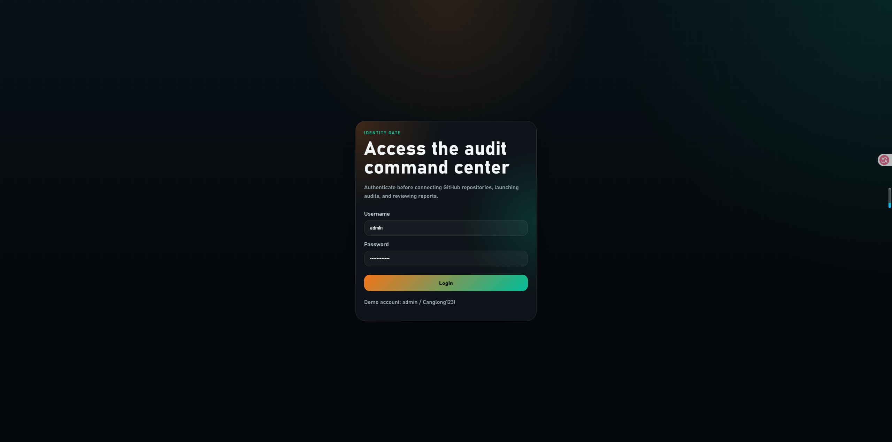
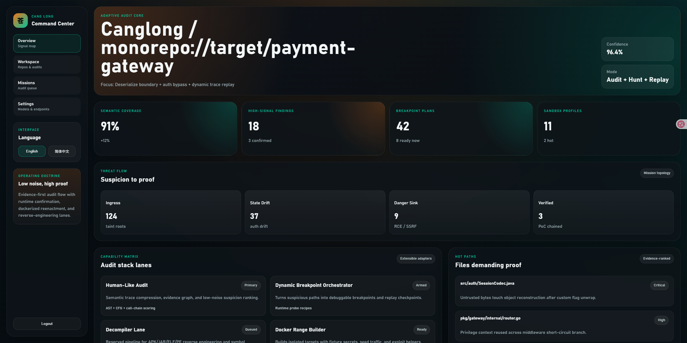
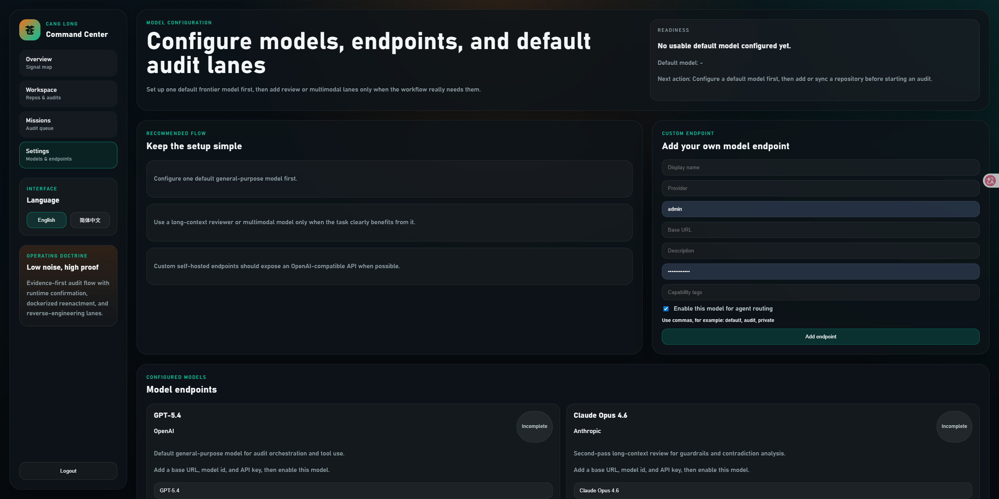

# Canglong

<div align="right">

[English](./README.md) | [简体中文](./README.zh-CN.md)

</div>

<div align="center">

**以证据为核心的代码审计、Java 利用链识别、面向 Docker 的验证，以及大模型辅助安全作战平台**

<p>
  
  
  
  
  
</p>

<p>
  
  
  
  
  
  
</p>

</div>

> Canglong 的目标不是再做一个高噪声规则扫描器，而是尽量接近一位高级安全审计工程师：
> 基于代码证据进行关联、降低误报、识别利用链、生成回放路径，并把模型辅助能力放到真正有用的位置。






## 目录

- [项目定位](#项目定位)
- [当前可用能力](#当前可用能力)
- [安全检测规则](#安全检测规则)
- [Java 审计策略](#java-审计策略)
- [模型编排](#模型编排)
- [快速开始](#快速开始)
- [用户操作流程](#用户操作流程)
- [API 一览](#api-一览)
- [仓库结构](#仓库结构)
- [开发指南](#开发指南)
- [路线图](#路线图)
- [补充说明](#补充说明)

## 项目定位

很多安全工具只在某一层表现不错，但在真正交付价值时断层明显：

- 只有静态扫描，没有运行时上下文
- 只有漏洞研究，没有清晰代码证据
- 只有逆向结果，没有统一的审计工作流
- 接了大模型，却没有任务路由、隐私边界和可复用执行面

Canglong 的方向是把这些能力收敛到一个面向操作者的工作台中：

- 支持本地代码和 Git 仓库接入
- 以证据排序的静态审计
- 面向 Java 的利用链识别
- 面向 Docker 的验证规划与可达性探测
- 中英文双语界面
- 面向不同任务的大模型编排和 Agent 协同

## 当前可用能力

### 操作体验

- 基于 Vue 3、TypeScript、Vite 的登录保护控制台
- 中英文切换
- 支持 Git URL 与本地源码目录的工作台
- 多模型配置页，可设置默认推理通道
- 审计任务进度、阶段状态与报告查看
- 增强的UI界面，带有流畅动画和视觉反馈

### 审计引擎

- 仓库语言、框架、打包方式和构建清单指纹识别
- Python、Java、JavaScript/TypeScript、Go 的接口发现
- `pom.xml`、Gradle、`requirements.txt`、`package.json`、`go.mod` 依赖证据提取
- 命令执行、不安全反序列化、弱加密、认证绕过等发现提升
- 报告内置误报抑制项说明
- Docker 验证规划、运行时可达性探测和需要登录提示

### 已落地的 Java 增强点

- Maven 与 Gradle 的 `groupId:artifactId` 级依赖识别
- Spring Boot、JAX-RS、Shiro、Dubbo、MyBatis、Struts、Hessian 等框架指纹
- Java 利用链候选自动生成与适用性检查
- 面向现代 JDK 的运行时约束降级逻辑
- 基于依赖证据的误报抑制

## 安全检测规则

Canglong 包含全面的安全检测规则，覆盖多个漏洞类别：

### 严重级别

| 类别 | 描述 | 检测模式 |
|------|------|----------|
| 命令执行 | 操作系统命令注入风险 | `subprocess.run(shell=True)`、`os.system()`、`Runtime.exec()`、`ProcessBuilder` |
| SQL注入 | 未参数化的SQL查询 | SQL中的字符串拼接、动态查询构建 |
| 不安全反序列化 | 不安全的对象重建 | `pickle.loads()`、`yaml.load()`、`ObjectInputStream`、`readObject()` |
| 硬编码凭证 | 源代码中的凭证 | 硬编码的密码、API密钥、密钥 |

### 高危级别

| 类别 | 描述 | 检测模式 |
|------|------|----------|
| XSS | 跨站脚本风险 | `innerHTML`、`dangerouslySetInnerHTML`、`v-html` |
| SSRF | 服务端请求伪造 | 带用户URL的 `requests.get()`、`urllib.urlopen()`、`HttpClient` |
| 路径遍历 | 目录遍历风险 | 带用户输入的文件操作、路径拼接 |
| 认证绕过 | 认证绕过分支 | `@PermitAll`、`skipAuth`、`AllowAnonymous` |
| 不安全文件上传 | 未验证的文件上传 | 缺少类型验证的文件上传处理 |

### 中危级别

| 类别 | 描述 | 检测模式 |
|------|------|----------|
| 弱加密 | 弱加密原语 | 安全上下文中的MD5、SHA-1使用 |
| 不安全随机数 | 可预测的随机数 | 安全上下文中的 `Math.random()`、`random.random()` |
| 信息泄露 | 信息泄漏 | 调试输出、堆栈跟踪、详细错误 |

## Java 审计策略

当前 Java 审计不是单纯做"命中一个规则就报一个洞"，而是尽量做链路关联。

### 静态关联层

- JNDI 查询链识别
- Fastjson AutoType 风险识别
- Hessian / Dubbo 反序列化链识别
- XStream XML 反序列化链识别
- 通用 Java Gadget 反序列化关联
- Spring 表达式注入提示
- Spring Security、Shiro 等鉴权框架的表面关联

### 适用性判断

每条 Java 利用链候选都会附带明确的判断项：

- 入口是否可达
- 是否存在依赖证据
- 是否命中代码落点
- 运行时是否有约束

这也是借鉴 `java-chains` 思路后最重要的落地点：
不能把所有可疑 sink 都当成同等可利用，必须结合依赖和运行环境做约束。

### 当前可输出的 Java 链条

- JNDI 远程命名链
- Fastjson AutoType Gadget 链
- Hessian 或 Dubbo 反序列化链
- XStream XML 反序列化链
- Java Gadget 反序列化链
- Spring 表达式注入链

## 模型编排

当前方向不是"模型列表展示页"，而是让模型真正参与安全工作流：

- 默认使用强通用推理模型作为主审计通道
- 长上下文复核任务路由到长上下文模型
- 逆向制品、图像、流程图任务路由到多模态模型
- 隐私受限场景支持私有化或 OpenAI 兼容网关

### 当前支持的 Provider 面

- OpenAI
- Anthropic
- Gemini
- Qwen
- DeepSeek
- 私有化 / OpenAI 兼容网关

### 规划中的 Agent 角色

- 利用链研究 Agent
- 误报压制 Agent
- Docker 靶场规划 Agent
- 反编译侦察 Agent

## 快速开始

### 环境要求

- Python 3.11+ 用于后端API
- Node.js 18+ 用于前端
- Docker（可选，用于容器化部署）

### 1. 启动前端

```bash
cd apps/web
npm install
npm run dev
```

前端将运行在 `http://localhost:5173`

### 2. 启动后端

```bash
cd apps/api
python -m venv .venv

# Windows
.venv\Scripts\activate

# Linux/macOS
source .venv/bin/activate

pip install -r requirements.txt
uvicorn app.main:app --reload --port 9000
```

API将运行在 `http://localhost:9000`

### 3. 使用 Docker Compose

```bash
docker compose up --build
```

这将启动前端和后端服务以及所有依赖。

### 演示账号

- 用户名：`admin`
- 密码：`Canglong123!`

## 用户操作流程

1. 打开 `/login` 并登录。
2. 如需配置默认模型或不同 Provider，进入 `/settings`。
3. 进入 `/workspace`，添加以下任一目标：
   - Git 仓库地址
   - 本地源码目录
4. 如果是 Git 仓库，则执行同步。
5. 在工作台卡片中启动审计任务。
6. 打开报告查看：
   - 环境指纹
   - 依赖证据
   - 接口发现
   - 利用链候选
   - 误报抑制项
   - Docker 验证状态
   - 运行时是否需要人工登录

## API 一览

| 方法 | 路由 | 说明 |
| --- | --- | --- |
| `GET` | `/healthz` | 服务健康检查 |
| `POST` | `/api/auth/login` | 登录并签发 Bearer Token |
| `GET` | `/api/auth/me` | 校验当前会话 |
| `GET` | `/api/dashboard` | 获取总览指标与首页数据 |
| `GET` | `/api/missions` | 获取任务列表 |
| `POST` | `/api/missions` | 创建任务 |
| `GET` | `/api/llm/stack` | 获取模型编排策略与 Agent 模板 |
| `POST` | `/api/llm/research-agents` | 提交模型辅助研究任务 |
| `GET` | `/api/settings/models` | 获取模型配置 |
| `POST` | `/api/settings/models` | 添加模型通道 |
| `PUT` | `/api/settings/models/{model_id}` | 更新模型通道 |
| `POST` | `/api/settings/models/{model_id}/default` | 设为默认通道 |
| `GET` | `/api/repos` | 获取仓库列表 |
| `POST` | `/api/repos` | 添加 Git 或本地仓库 |
| `POST` | `/api/repos/{repo_id}/sync` | clone / pull Git 仓库或校验本地路径 |
| `GET` | `/api/audits` | 获取审计任务列表 |
| `POST` | `/api/audits` | 启动审计任务 |
| `GET` | `/api/audits/{job_id}` | 获取任务进度与阶段状态 |
| `GET` | `/api/audits/{job_id}/report` | 获取审计报告 |

## 仓库结构

```text
.
|-- apps
|   |-- api
|   |   |-- app
|   |   |   |-- models
|   |   |   |   `-- schemas.py       # Pydantic模型
|   |   |   |-- routers
|   |   |   |   |-- audits.py        # 审计端点
|   |   |   |   |-- auth.py          # 认证
|   |   |   |   |-- dashboard.py     # 仪表板数据
|   |   |   |   |-- llm.py           # 模型网格
|   |   |   |   |-- missions.py      # 任务管理
|   |   |   |   |-- repos.py         # 仓库管理
|   |   |   |   `-- settings.py      # 模型设置
|   |   |   `-- services
|   |   |       |-- audit_engine.py  # 核心审计逻辑
|   |   |       |-- auth_service.py  # 认证实现
|   |   |       |-- model_settings.py
|   |   |       `-- repo_manager.py
|   |   |-- Dockerfile
|   |   `-- requirements.txt
|   `-- web
|       |-- src
|       |   |-- components           # Vue组件
|       |   |-- router               # Vue Router配置
|       |   |-- services             # API客户端
|       |   |-- styles               # CSS样式
|       |   |-- views                # 页面组件
|       |   |-- i18n                 # 国际化
|       |   `-- auth                 # 认证
|       |-- Dockerfile
|       `-- package.json
|-- docs
|   `-- architecture.md
|-- docker-compose.yml
`-- package.json
```

## 开发指南

### 添加新的安全规则

要添加新的安全检测规则，请编辑 [`apps/api/app/services/audit_engine.py`](apps/api/app/services/audit_engine.py:112)：

```python
FindingMatch(
    title_en="Your rule title",
    title_zh="规则标题",
    category="your-category",
    severity="critical",  # critical, high, medium, low
    summary_en="Description in English",
    summary_zh="中文描述",
    pattern=re.compile(r"your-regex-pattern"),
    chain_en=["Step 1", "Step 2", "Step 3"],
    chain_zh=["步骤1", "步骤2", "步骤3"],
),
```

### 添加新语言支持

1. 在 [`guess_language()`](apps/api/app/services/audit_engine.py:202) 中添加语言检测
2. 在 [`discover_endpoints()`](apps/api/app/services/audit_engine.py:505) 中添加端点发现逻辑
3. 在 [`collect_dependencies()`](apps/api/app/services/audit_engine.py:317) 中添加依赖提取

### 前端开发

前端使用 Vue 3 和 TypeScript。关键文件：

- [`App.vue`](apps/web/src/App.vue) - 根组件
- [`AppShell.vue`](apps/web/src/components/AppShell.vue) - 主布局
- [`router/index.ts`](apps/web/src/router/index.ts) - 路由定义
- [`i18n/messages.ts`](apps/web/src/i18n/messages.ts) - 翻译

## 路线图

- [x] Web 与 API 单仓骨架
- [x] 登录、会话和受保护路由
- [x] Git 与本地目录的仓库接入
- [x] 后台审计任务与报告生成
- [x] 模型配置页与多 Provider 编排面
- [x] Java 依赖指纹与利用链识别
- [x] 误报抑制项报告
- [x] 双语 README 与双语界面切换
- [x] 增强的安全检测规则（SQL注入、XSS、SSRF、路径遍历等）
- [x] 改进的UI/UX，带有动画和视觉反馈
- [ ] 仓库与审计历史的持久化
- [ ] 更深层 AST / 数据流审计引擎
- [ ] 面向断点的运行时执行器
- [ ] 面向不同技术栈的完整 Docker 部署与回放编排
- [ ] 二进制输入与反编译适配器
- [ ] 多用户协作与证据导出

## 补充说明

### 产品方向

Canglong 的长期目标不是单点规则扫描，而是统一以下能力：

- 代码审计
- 漏洞研究
- 运行时验证
- 逆向分析
- 大模型辅助审计工作流

### GitHub 展示元素

本 README 故意使用 GitHub 原生展示能力：

- 徽章
- 表格
- 任务清单
- 中英文切换

目的是让仓库首页看起来像一个真实可用的产品，而不是占位文档。

### 贡献

欢迎贡献！请随时提交问题和拉取请求。

### 许可证

本项目目前处于Alpha阶段。许可证条款将在首次稳定版本发布前公布。
