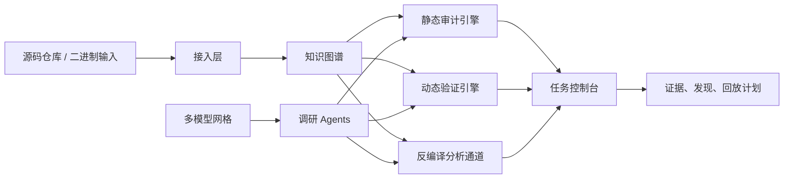

# Canglong

<div align="right">

[English](./README.md) | [简体中文](./README.zh-CN.md)

</div>

<div align="center">

**以证据为核心的代码审计、漏洞挖掘、Docker 化验证与大模型辅助安全作战平台**

<p>
  
  
  
  
  
</p>

<p>
  
  
  
  
  
  
</p>

</div>

> Canglong 的目标不是做一个只会报规则的扫描器，而是更接近一位高级安全审计工程师：
> 追踪证据、压低误报、生成可验证攻击路径、编排 Docker 靶场，并为不同安全任务选择合适的大模型或调研 Agent。


## 目录

- [项目定位](#项目定位)
- [核心能力](#核心能力)
- [系统架构](#系统架构)
- [多模型编排](#多模型编排)
- [仓库结构](#仓库结构)
- [快速开始](#快速开始)
- [API 一览](#api-一览)
- [开发流程](#开发流程)
- [路线图](#路线图)
- [附注](#附注)

## 项目定位

很多安全工具通常只擅长其中一部分：

- 只会做静态扫描，但没有真实证据
- 能做动态验证，但缺少全局图谱上下文
- 能处理反编译结果，但无法纳入统一证据模型
- 接入了 AI，却没有任务路由、权限控制和隐私边界

Canglong 的目标是把这些能力统一为一个面向操作者的安全工作台：

- 像人一样审计，而不是只输出规则命中
- 基于证据提升漏洞等级，而不是泛滥报高危
- 自动拉起可复现的 Docker 环境做验证
- 为 APK、JAR、ELF、PE 等输入提供反编译分析通道
- 根据推理深度、上下文长度、多模态能力、成本和私有化要求路由到不同模型

## 核心能力

| 能力 | 作用 | 价值 |
| --- | --- | --- |
| 类人工审计流程 | 将代码结构转成证据优先的审计路径 | 降低误报并减少审计疲劳 |
| 漏洞研究任务 | 将单个目标从怀疑推进到验证 | 让可利用性和证据持续绑定 |
| 动态断点编排 | 从静态路径直接生成调试与回放计划 | 让可疑路径真正可证伪、可验证 |
| Docker 靶场构建 | 自动生成隔离环境、依赖和测试数据 | 提高漏洞复现和环境搭建效率 |
| 反编译分析通道 | 把逆向后的符号和结构并入统一图谱 | 打通源码审计和二进制分析 |
| 多模型网格 | 在商用与私有模型之间做任务路由 | 兼顾成本、性能、上下文和合规 |
| 调研 Agent | 让大模型成为真正的安全执行单元 | 用于利用链扩展、误报压制和环境规划 |

## 系统架构



### 架构分层

| 层级 | 当前设计方向 |
| --- | --- |
| 接入层 | Git 仓库、压缩包、挂载目录、二进制输入 |
| 知识图谱 | 文件图、符号图、污点图、请求到危险点路径图 |
| 静态审计 | 框架感知 Source/Sink、语义路径压缩、证据融合 |
| 动态验证 | 断点配方、回放计划、运行时矛盾校验 |
| 逆向通道 | 反编译符号恢复、接口恢复、字符串与密钥提取 |
| 多模型网格 | 基于任务类型、隐私边界、成本和上下文做路由 |
| 控制台 | 面向审计人员展示证据、下一步动作与验证状态 |

<details>
<summary><strong>设计原则：最大限度降低误报</strong></summary>

Canglong 不应该把每个可达 sink 都直接提升成高危漏洞。目标策略是：

- 严重级别提升前必须满足多信号一致
- 每条结论都保留原始证据
- 按可利用性、前置条件和运行时可达性排序
- 对被框架守卫、净化逻辑、类型约束或容器回放否定的路径降级

</details>

## 多模型编排

模型层必须异构化。不同安全任务本身就需要不同模型能力。

| 模型通道 | 最适合场景 | 示例任务 |
| --- | --- | --- |
| OpenAI | 深度推理、工具调用、结构化输出 | 利用链推演、Agent 编排、报告综合 |
| Anthropic | 长上下文审阅 | 大型代码仓审计、矛盾分析、守卫校验 |
| Gemini | 多模态与大体量制品理解 | 反编译产物、截图、流程图、二进制摘要 |
| Qwen | 私有化与中英双语执行 | 内网部署、敏感代码审计、中文场景 |
| DeepSeek | 低成本广域推理 | 大规模假设扩展、批量初筛 |
| 私有化推理网格 | 隔离、合规、可控 | 空气隔离、数据驻留、企业内网推理 |

### 规划中的调研 Agents

| Agent | 职责 | 预期输出 |
| --- | --- | --- |
| 利用链调研 Agent | 将可疑路径扩展为攻击前置条件和可利用链路 | 利用假设、回放提示词、验证清单 |
| 误报压制 Agent | 在升级严重性前检查守卫、净化和矛盾条件 | 降级建议、证据缺口、矛盾日志 |
| Docker 靶场规划 Agent | 将攻击假设转换成可运行环境 | Compose 方案、测试数据、探针配方 |
| 反编译侦察 Agent | 把逆向制品转成可操作攻击面地图 | 恢复接口、符号提示、库风险说明 |

## 仓库结构

```text
.
|-- apps
|   |-- api
|   |   |-- app
|   |   |   |-- models
|   |   |   |-- routers
|   |   |   `-- services
|   |   |-- Dockerfile
|   |   `-- requirements.txt
|   `-- web
|       |-- src
|       |   |-- components
|       |   |-- router
|       |   |-- services
|       |   |-- styles
|       |   `-- views
|       |-- Dockerfile
|       `-- package.json
|-- docs
|   `-- architecture.md
|-- docker-compose.yml
`-- package.json
```

## 快速开始

### 1. 启动前端

```bash
cd apps/web
npm install
npm run dev
```

### 2. 启动后端

```bash
cd apps/api
python -m venv .venv
.venv\Scripts\activate
pip install -r requirements.txt
uvicorn app.main:app --reload --port 9000
```

### 3. 使用 Docker Compose

```bash
docker compose up --build
```

前端默认从 `http://127.0.0.1:9000` 访问 API。若有需要，可通过 `VITE_API_BASE_URL` 覆盖。

## API 一览

| 方法 | 路由 | 说明 |
| --- | --- | --- |
| `GET` | `/healthz` | 服务健康检查 |
| `GET` | `/api/dashboard` | 总览指标、证据态势与首页数据 |
| `GET` | `/api/missions` | 当前审计任务列表 |
| `POST` | `/api/missions` | 创建新的审计任务 |
| `GET` | `/api/llm/stack` | 多模型网格、路由策略和 Agent 模板 |
| `POST` | `/api/llm/research-agents` | 提交一个大模型调研 Agent 任务 |

## 开发流程

### 前端

```bash
cd apps/web
npm run build
```

### 后端

```bash
cd apps/api
python -m compileall app
```

### 项目文档

- 架构蓝图: [`docs/architecture.md`](./docs/architecture.md)
- API 入口: [`apps/api/app/main.py`](./apps/api/app/main.py)
- 总览页面: [`apps/web/src/views/OverviewView.vue`](./apps/web/src/views/OverviewView.vue)

<details>
<summary><strong>当前实现重点</strong></summary>

- 仓库接入与语言指纹识别
- 任务持久化与扫描队列
- Java、Go、Python、PHP、JavaScript、TypeScript 适配器
- Docker 模板仓与运行时探针 Agent
- 反编译适配器与制品接入流程
- 真实模型 SDK 接入与私有化安全路由

</details>

## 路线图

- [x] Web 与 API 单仓骨架
- [x] 面向操作员的 Vue 控制台
- [x] FastAPI 编排层
- [x] 多模型网格与调研 Agent 展示面
- [x] Docker 就绪的本地开发骨架
- [ ] 真实仓库接入与图谱持久化
- [ ] 语言感知审计引擎
- [ ] 运行时断点执行器
- [ ] 反编译分析流水线适配器
- [ ] 任务持久化、鉴权与协作
- [ ] 各模型 SDK 适配层与 Prompt 包注册中心
- [ ] 证据导出与正式报告流水线

## 附注

### 项目方向

Canglong 正在被构建成一个安全作战工作台，而不是单一用途扫描器。长期目标是将以下能力统一到一个产品中：

- 代码审计
- 漏洞研究
- 动态验证
- 逆向分析
- 大模型辅助操作流

### GitHub 专业化展示元素

这个双语 README 有意使用了 GitHub 原生常见展示元素：

- 徽章
- 表格
- 折叠区块
- Mermaid 架构图
- 任务清单式路线图
- 中英文切换导航

这样无论是客户、团队成员还是开源访问者，都可以在英文和中文之间快速切换，并直接理解项目定位和技术深度。
